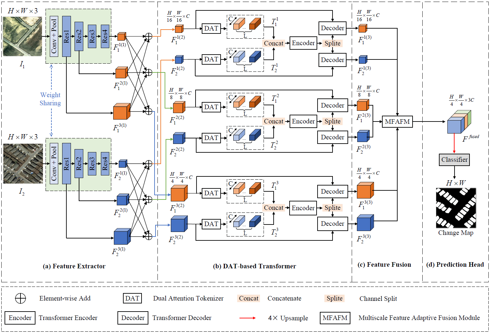
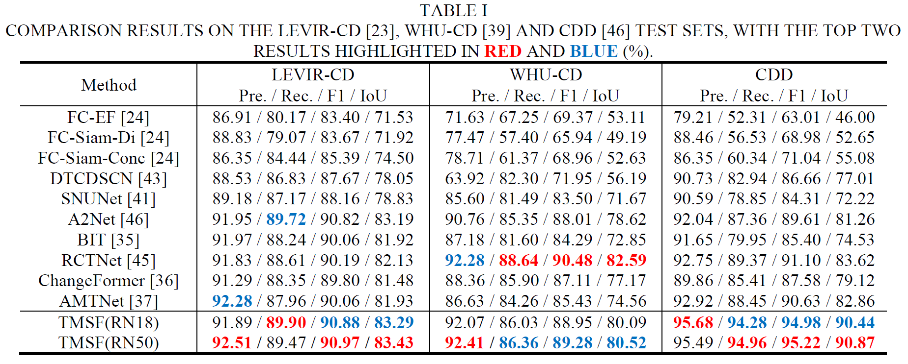

# A Novel Transformer-based Multiscale Siamese Framework for High-resolution Remote Sensing Change Detection

Here, we provide the pytorch implementation of the paper: A Novel Transformer-based Multiscale Siamese Framework for High-resolution Remote Sensing Change Detection.

[//]: # (For more ore information, please see our published paper at [IEEE J-STARS]&#40;https:; or [arxiv]&#40;https:. )



## Requirements
```
Python 3.9
pytorch 1.12.1
torchvision 0.13.1
```
- Please see `requirements.txt` for all the other requirements.

## DataSet
* Download the [LEVIR-CD Dataset](https://pan.baidu.com/s/1C36GkVrM2u0oRqsBX_K2Dg?pwd=9559)
* Download the [WHU-CD Dataset](https://pan.baidu.com/s/1XygFVRmXlT-wQX3zacjdBQ?pwd=h643)
* Download the [CDD Dataset](https://pan.baidu.com/s/1SZt6qckfdAE6N6MGWBmBvA?pwd=g9p7)

```
Prepare datasets into following structure and set their path in `data_config.py`

  ├─Train
  ├─A        ...jpg/png
  ├─B        ...jpg/png
  ├─label    ...jpg/png
  └─list     ...txt
  ├─Val
  ├─A
  ├─B
  ├─label
  └─list
  ├─Test
  ├─A
  ├─B
  ├─label
  └─list
  ```
## Train
```
python train_eval_option.py
```
- Hyperparameters can be set in 'train_eval_option.py'.
- The training logs and saved model checkpoint files can be found in './checkpoints/{args.data_name}/'.
- Visualization results generated during training are available in './vis_{args.data_name}/'.
## Test
```
python test_option.py
```
- Test logs are also saved in './checkpoints/{args.data_name}/'.
- Visualization results for the test process are available in './vis_{args.data_name}/'.
- Heatmap visualizations on the test set can be found in './heatmaps/'.

## Pretrained Models
We provide pretrained models trained on three datasets for reproducibility and further research. You can download them via the [Baidu Cloud](https://pan.baidu.com/s/1tzJlEGDaWdnd_zsifKsCHA?pwd=23ed):

After downloading, please copy the pretrained models to the following directory:
```
./checkpoints/{args.data_name}/{args.project_name}/

```
Then, simply run test_option.py to perform inference.




